# Task 4: Enhanced Distributed Pub/Sub Architecture

## Problem Statement

The current single-server Pub/Sub implementation has a critical weakness: **Single Point of Failure (SPOF)**. If the server crashes or becomes unavailable, the entire messaging system fails—publishers cannot send messages, and subscribers cannot receive them.

---

## Current Architecture (Single Server)

```mermaid
graph TB
    subgraph "Single Point of Failure"
        Server["🖥️ Single Server<br/>(Message Broker)"]
    end

    P1["📤 Publisher 1"] --> Server
    P2["📤 Publisher 2"] --> Server
    P3["📤 Publisher 3"] --> Server

    Server --> S1["📥 Subscriber 1"]
    Server --> S2["📥 Subscriber 2"]
    Server --> S3["📥 Subscriber 3"]

    style Server fill:#ff6b6b,stroke:#333,stroke-width:2px,color:#fff
```

### Issues with Current Architecture

| Issue                       | Impact                                        |
| --------------------------- | --------------------------------------------- |
| **Single Point of Failure** | If server crashes, entire system is down      |
| **No Fault Tolerance**      | No backup to handle failures                  |
| **Limited Scalability**     | One server handles all traffic                |
| **No Message Persistence**  | Messages lost if server fails during delivery |

---

## Proposed Distributed Architecture

### Architecture Diagram

```mermaid
graph TB
    subgraph "Load Balancer Layer"
        LB["⚖️ Load Balancer<br/>(HAProxy/Nginx)"]
    end

    subgraph "Broker Cluster"
        B1["🖥️ Broker 1<br/>(Primary)"]
        B2["🖥️ Broker 2<br/>(Replica)"]
        B3["🖥️ Broker 3<br/>(Replica)"]
    end

    subgraph "Coordination Layer"
        ZK["🔧 Coordination Service<br/>(ZooKeeper/etcd)"]
    end

    subgraph "Persistent Storage"
        DB1[(Message Store 1)]
        DB2[(Message Store 2)]
    end

    P1["📤 Publisher 1"] --> LB
    P2["📤 Publisher 2"] --> LB
    P3["📤 Publisher 3"] --> LB

    LB --> B1
    LB --> B2
    LB --> B3

    B1 <--> B2
    B2 <--> B3
    B1 <--> B3

    B1 --> ZK
    B2 --> ZK
    B3 --> ZK

    B1 --> DB1
    B2 --> DB1
    B3 --> DB2

    B1 --> S1["📥 Subscriber 1"]
    B2 --> S2["📥 Subscriber 2"]
    B3 --> S3["📥 Subscriber 3"]

    style B1 fill:#4ecdc4,stroke:#333,stroke-width:2px
    style B2 fill:#95e1d3,stroke:#333,stroke-width:2px
    style B3 fill:#95e1d3,stroke:#333,stroke-width:2px
    style LB fill:#ffeaa7,stroke:#333,stroke-width:2px
    style ZK fill:#a29bfe,stroke:#333,stroke-width:2px
```

---

## Key Components of the Proposed Architecture

### 1. Load Balancer Layer

- **Purpose**: Distributes incoming connections across multiple broker nodes
- **Implementation**: HAProxy, Nginx, or cloud-based load balancers
- **Benefits**:
  - Even distribution of client connections
  - Health checking of broker nodes
  - Automatic failover to healthy nodes

### 2. Broker Cluster (Multiple Servers)

- **Purpose**: Multiple message broker instances working together
- **Configuration**: Primary-Replica or Active-Active setup
- **Benefits**:
  - **Redundancy**: If one broker fails, others continue operating
  - **Load Distribution**: Messages processed in parallel
  - **Horizontal Scaling**: Add more brokers as demand grows

### 3. Coordination Service (ZooKeeper/etcd)

- **Purpose**: Manages cluster state and leader election
- **Responsibilities**:
  - Detecting failed brokers
  - Electing new primary broker when current primary fails
  - Maintaining consistent cluster configuration
  - Storing subscriber/topic mappings

### 4. Persistent Message Storage

- **Purpose**: Durable storage for messages
- **Implementation**: Replicated database or distributed file system
- **Benefits**:
  - Messages survive broker failures
  - Subscribers can receive missed messages after reconnection
  - Supports message replay for new subscribers

---

## Failure Handling Scenarios

### Scenario 1: Single Broker Failure

### Scenario 2: Network Partition Recovery

---

## Replication Strategies

### Option A: Leader-Follower Replication

- **Write**: All writes go to the leader
- **Read**: Any node can serve reads
- **Failover**: Follower promoted to leader if leader fails

### Option B: Multi-Primary Replication

- **Write**: Any broker accepts writes
- **Sync**: Changes synchronized between brokers
- **Best For**: High write throughput scenarios

---

## Improvements Over Single Server Architecture

| Aspect                 | Single Server              | Distributed Architecture             |
| ---------------------- | -------------------------- | ------------------------------------ |
| **Availability**       | ❌ Single point of failure | ✅ Multiple redundant nodes          |
| **Reliability**        | ❌ Data loss on failure    | ✅ Message persistence & replication |
| **Scalability**        | ❌ Limited by one server   | ✅ Horizontal scaling                |
| **Fault Tolerance**    | ❌ No automatic recovery   | ✅ Auto-failover capability          |
| **Message Durability** | ❌ In-memory only          | ✅ Persistent storage                |
| **Performance**        | ❌ Bottleneck at server    | ✅ Load distributed across nodes     |

---

## Implementation Technologies

For implementing this distributed architecture, the following technologies can be used:

| Component            | Technology Options                      |
| -------------------- | --------------------------------------- |
| **Load Balancer**    | HAProxy, Nginx, AWS ELB                 |
| **Coordination**     | Apache ZooKeeper, etcd, Consul          |
| **Message Storage**  | Apache Kafka, Redis Cluster, PostgreSQL |
| **Broker Framework** | RabbitMQ Cluster, Apache ActiveMQ       |

---

## Conclusion

The proposed distributed Pub/Sub architecture addresses the **single point of failure** issue by introducing:

1. **Redundancy** through multiple broker nodes
2. **Automatic failover** via coordination services
3. **Message durability** through persistent storage
4. **Load distribution** using load balancers

This architecture ensures that the messaging system remains **available** and **reliable** even when individual components fail, making it suitable for production environments where downtime is unacceptable.
